# Overview

QueryBuilder lets you build and run complex database queries without entering a single keystroke. It provides the same kinds of analysis as Analyzer, but it uses a very different approach.

The server maintains a database, which it uses for configuration information and snapshots of tables or views from other databases. The configuration information describes the databases and tables that have been defined to the system.

The browser-based client application features a familiar drag-and-drop query builder with support for an arbitrary number of concurrent database connections. It includes the following functions:

* Create connections to multiple server databases (via JDBC)
* Add tables to query builder panels
* Select columns to display
* Specify join conditions
* Specify filter criteria
* Run queries
* Import snapshots from tables or views
* Define calculated columns
* Describe and display tables
* Create pivot queries

In general, the client uses a drag and drop metaphor to allow you to interact with objects. In addition, double-clicking generally performs the most common action, so it is possible to create a wide range of queries just by double-clicking or drag and drop.

Of course, sophisticated and highly customized queries do require some typing!

# A tour of the QueryBuilder user interface

## Creating a Connection

The basic user interface features a hierarchical view of connections, database and tables on the left and details on the right. Details include query builders as well as the output from the describe and display actions.

The table view includes the number of rows and columns that the table had at a given point in time. The Refresh button refreshes this information. Queries that reference external tables always use the current contents of the table.

You can capture a snapshot of a table or view using the Import button. Each snapshot is marked with the number of rows and columns and the time it was created. Snapshots are useful for creating cross-database joins, as well as identifying trends.

You can use the delete button to delete database connections you no longer need. This deletes any snapshots, as well as the connection definition, but it doesn't modify external databases. You can also delete snapshots individually.

The user interface disables buttons for actions that are not available given the current context. If a button is disabled and you want to perform its action, it generally means you need to supply or configure additional information first.

Press Okay to create the connection and leave the dialog box open for another connection, or press Okay if you only want to create a single connection. Press the X in the upper right corner of the Create Connection dialog box to close it.  

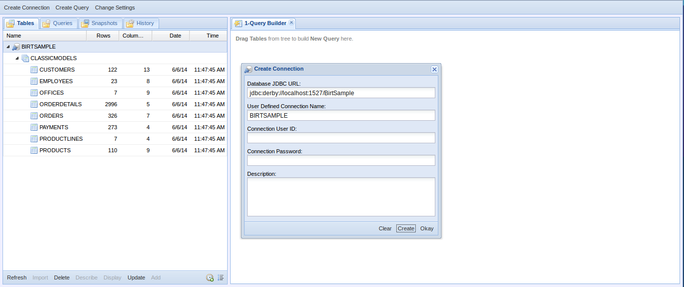

## Adding Tables to the Query Builder

Double-click or drag and drop a table in the table view to add it to a query builder. Each table in the query appears on the top right, with the title consisting of the table name and a unique identifier. The unique identifier is used to reference the table in the generated query. Below the title are the columns in the table.

If you accidentally add a table you don't want, or want to remove a table you no longer need, just click on the X in the upper right of the table to remove it from the query builder.

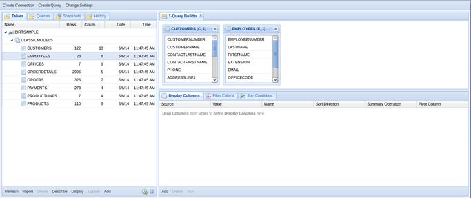

## Selecting Columns to Display

Double-click or drag and drop a column name from the Query Builder in the top right panel to the Display Columns tab in the panel below it. Then double click on any of the fields marked with a pencil icon to customize:

* Displayed name
* Sort direction
* Summarization (e.g. average, count)
* Pivot

In addition, you can add calculated columns by pressing the Add button, which launches the Formula Builder wizard.

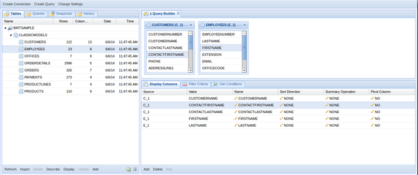

## Specifying Join Conditions

If you have more than one table in your query, you will see a Join Conditions tab to the right of the Display Columns tab. Here you can specify the relationship(s) that join the tables in the query. You can select columns from the tables in the top right by drag and drop or double-click.

You can also specify the join type and join condition. QueryBuilder requires that you specify at least one join condition for every two tables in the query (i.e. the total number of join conditions must be at least the total number of tables in the query, minus one).

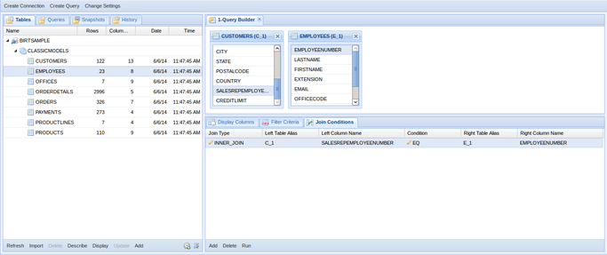

## Specifying Filter Criteria

The Filter Criteria tab is to the right of the Display Columns tab and to the left of the Join Conditions tab (if it is present). The Filter Criteria tab lets you specify conditions that determine which rows you want in the output. You can add columns to the filter criteria by double clicking on the desired column in the table in the top right panel, or use drag and drop to drag columns from the table to the filter criteria.

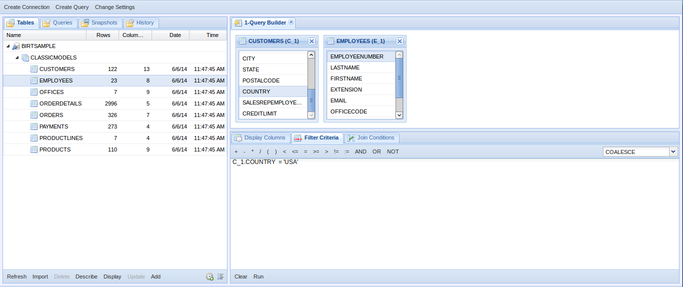

## Running a Query

Once you have selected one or more columns, entered any required join conditions and specified optional filter criteria, the Run button will be enabled and you can press it to see the query results.

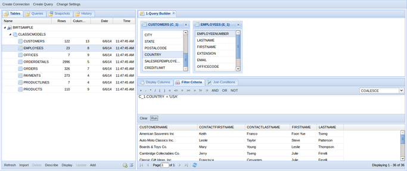

## Creating Additional Database Connections

You can add any number of additional database connections, just by going back to the Tables tab on the left, and pressing the Add button.

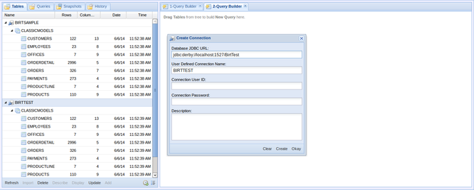

## Creating a Cross Database Join using Imported Tables

If you want to join tables across databases you need to import them first. Just click on the desired table in the table navigator on the left and press the Import button. This creates a local snapshot. The icon is marked with a green arrow to indicate it is an imported snapshot.

If you try to join tables across databases that are not imported (i.e. marked with the green arrow), you will be reminded that you can only join across tables in the same database or using imported tables.

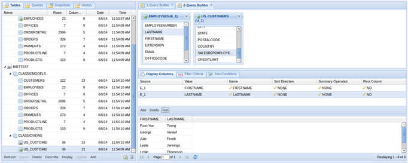

## Defining Calculated Columns

A query can include any number of calculated columns. Press the Add button to open the Formula Builder.

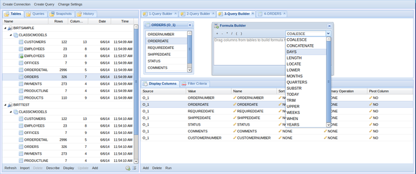

## Describing a Table

Press the Describe button in the table navigator on the left to display the structure of a table.

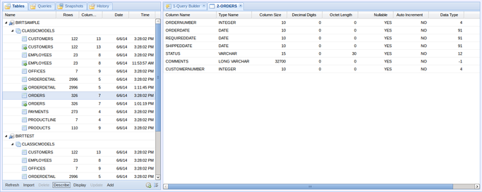

## Defining a Pivot Query

Set the Pivot Column to YES to pivot on the specified column.

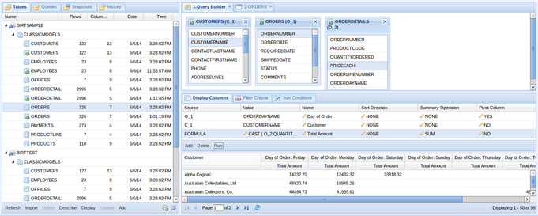

